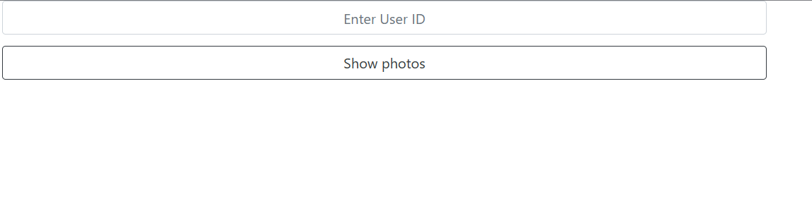
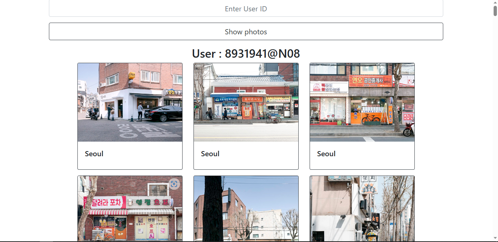

# This is part of the Forms Project in The Odin Project’s Ruby on Rails Curriculum. Find it at [http://www.theodinproject.com]

## there a form you should fill it with your user_id

## then you will see the result

